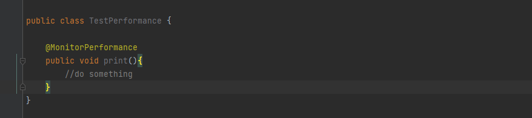
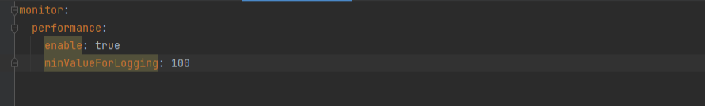
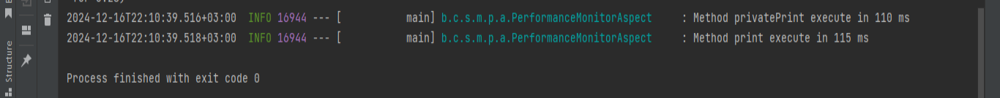

starter-monitor-performance - библиотека для мониторинга времени работы методов, реализованная в виде стартера.

- @MonitorPerformance - маркерная аннотация для методов, которые необходимо промониторить;

Properties (prefix - monitor.performance):

- enable = true || false (default) 
- minValueForLogging - минимальное время работы метода для логирования (в миллисекундах)

Результат работы библиотеки:

